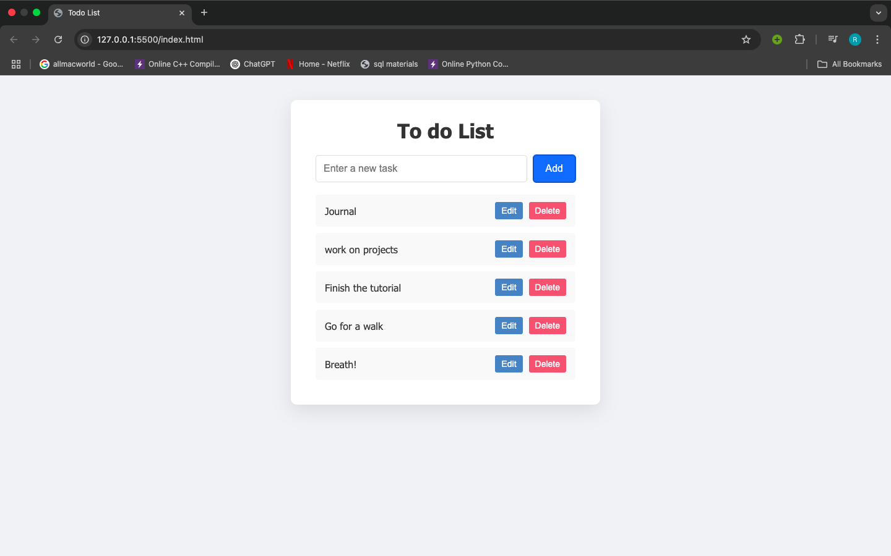
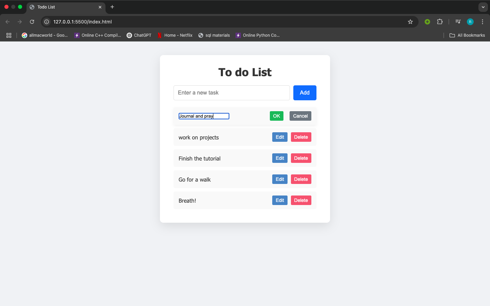
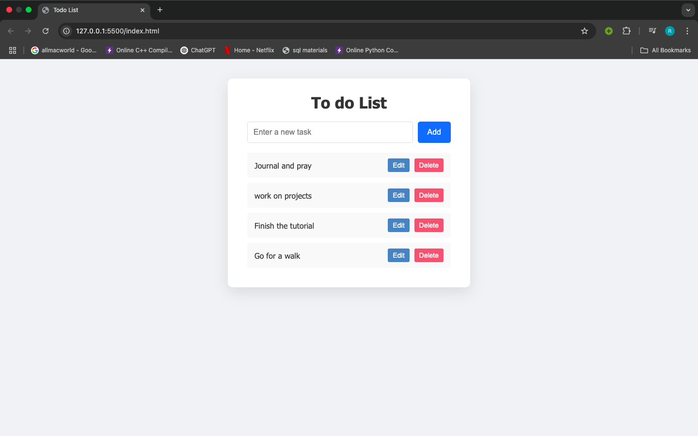

# Todo List Web App

### A simple and interactive task management tool built with JavaScript

---

## Project Description

This is a lightweight Todo List application that allows users to:

- Add new tasks
- Edit existing tasks
- Delete tasks

The project was built using HTML, CSS, and JavaScript. It focuses on practicing core JavaScript concepts such as DOM manipulation, event handling, and basic styling using CSS.

---

## Screenshots

### Main Page (Add Tasks)

  
This is the main interface where users can enter and add tasks. Sample tasks have been added to demonstrate the application's functionality.

### Edit Task

  
Clicking the Edit button allows users to change task names. OK and Cancel buttons are provided to confirm or cancel changes.

### Delete Task

  
This screenshot shows a list with tasks rempved from the previous. The Delete button next to each task removes it from the list when clicked.

All screenshots are stored in the `screenshots/` folder.

---

### How to Run the Application

1. Clone the repository:

   ```bash
   git clone https://github.com/Ruth652/todo-list.git
   ```

2. Open the application:
   - Double-click on `index.html`, or
   - Right-click and choose "Open with" your preferred browser

## How to Use

### 1. Add a task:

- Type your task in the input field
- Press Enter or click the Add button

### 2. Edit a task:

- Click the Edit button next to the task
- Make your changes
- Click OK to save or Cancel to discard

### 3. Delete a task:

- Click the Delete button next to the task you want to remove
